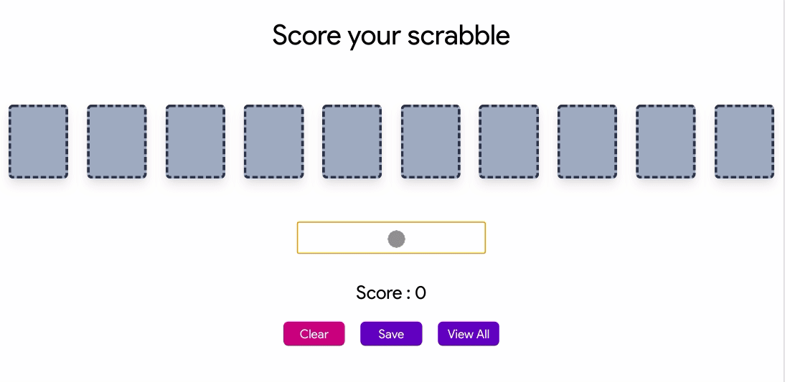

# Scrabble Score Calculator

This project calculates your score based on the word you entered. You can save your entries and view all of them as well.

### `npm run dev`

Runs the app (both frontend and backend simultaneously) in the development mode. 
Client will be running at __localhost:3000__ and server will be running at __localhost:5000__

### `npm test`

Launches the test runner in the interactive watch mode. 

### `npm run build`

Builds the app for production to the `build` folder. 
